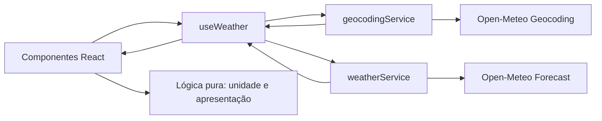

# Plano Técnico — Weather App

Este plano deriva de `specs/weather-app-spec.md`. Os requisitos funcionais são
referidos como RF1–RF6. Como a especificação mantém o provedor, os campos
meteorológicos e alguns comportamentos em aberto, as propostas abaixo são
decisões de planejamento, não requisitos de produto fechados. Elas devem ser
confirmadas antes da implementação correspondente.

## 1. Architecture Overview

Aplicação SPA React com fluxo unidirecional e três camadas principais:

- **Apresentação (`components/`):** busca, seleção de cidade, clima atual,
  previsão, unidade e estados visuais. Componentes recebem dados e ações por
  props. Relaciona-se a RF1–RF6.
- **Orquestração (`hooks/`):** um hook `useWeather` coordena busca, seleção,
  carregamento meteorológico, unidade e erro, sem dependência de biblioteca
  global de estado. Relaciona-se a RF1–RF4 e RF6.
- **Dados (`services/`):** módulos isolados chamam geocoding e previsão, validam
  respostas e convertem o formato do provedor em tipos da aplicação.
  Relaciona-se a RF1–RF3 e RNF Resiliência.
- **Lógica pura (`lib/`):** conversão de temperatura, mapeamento de códigos de
  clima e formatação de datas; facilita testar RF3–RF4.
- **Contratos (`types/`):** modelos internos independentes do formato JSON da
  API.



## 2. Tech Stack

| Camada | Tecnologia proposta | Justificativa e rastreabilidade |
| --- | --- | --- |
| Linguagem | TypeScript em modo strict | Tipos explícitos para cidades, clima e estados reduzem erros de integração; RF1–RF4. É também a convenção do projeto. |
| Interface | React + Vite | SPA adequada à consulta interativa e à distribuição estática; RF1–RF6. Já adotada pelo projeto. |
| Estilo | Tailwind CSS | Permite compor layouts adaptáveis para dispositivos móveis; RF5 e RNF Responsividade. Já adotado pelo projeto. |
| Dados | Open-Meteo Geocoding e Forecast | APIs sem chave permitem busca e previsão sem serviço de backend próprio; RF1–RF3 e RNF Resiliência. Proposta do projeto e deste prompt; a spec ainda registra o provedor como questão em aberto. |
| Testes unitários | Vitest + Testing Library | Testam conversão, mapeamento, estados e interações isoladamente; RF1–RF6. Já disponíveis no projeto. |
| Testes ponta a ponta | Playwright | Verifica fluxo integrado e uso móvel em navegador; RF1–RF5 e RNF Responsividade. Já disponível no projeto. |

## 3. Project Structure

Estrutura proposta para as responsabilidades do aplicativo, seguindo as
convenções registradas em `AGENTS.md` e evitando uma camada de estado externa:

```text
src/
├── components/
│   ├── SearchBar.tsx
│   ├── CityResults.tsx
│   ├── CurrentWeather.tsx
│   ├── ForecastList.tsx
│   ├── UnitToggle.tsx
│   └── states/
│       ├── LoadingState.tsx
│       ├── EmptyState.tsx
│       └── ErrorState.tsx
├── hooks/
│   └── useWeather.ts
├── services/
│   ├── geocodingService.ts
│   └── weatherService.ts
├── lib/
│   ├── temperature.ts
│   ├── weatherCodes.ts
│   └── formatDate.ts
├── types/
│   └── weather.ts
└── App.tsx

tests/
├── unit/
└── e2e/
```

Os nomes são contratos organizacionais propostos, não uma exigência de criar
cada arquivo se a implementação existente já tiver um local equivalente.

## 4. Data Model

Os modelos abaixo isolam a aplicação do JSON do provedor. Temperaturas são
mantidas em Celsius; a conversão é derivada na apresentação (RF4), sem novo
request. Campos além da temperatura são uma proposta mínima para representar
condição e período; detalhes meteorológicos adicionais dependem da resposta à
pergunta aberta da spec.

```ts
export type TemperatureUnit = 'celsius' | 'fahrenheit';

export interface City {
  id?: number;
  name: string;
  country?: string;
  region?: string;
  latitude: number;
  longitude: number;
  timezone?: string;
}

export interface CurrentWeather {
  temperatureC: number;
  weatherCode: number;
  observedAt: string;
}

export interface ForecastDay {
  date: string;
  minTemperatureC: number;
  maxTemperatureC: number;
  weatherCode: number;
}

export interface WeatherData {
  city: City;
  current: CurrentWeather;
  forecast: ForecastDay[];
}
```

`forecast` deve conter cinco datas retornadas e validadas. A escolha de incluir
o dia atual depende da resposta à pergunta correspondente na spec. Os códigos
de condição são convertidos para rótulos/ícones em `lib/weatherCodes.ts`; não
devem ser exibidos como números brutos.

## 5. Data Flow

1. A pessoa informa uma cidade e envia a busca (`RF1`). O hook marca a busca
   como pendente e chama `geocodingService.searchCities(query)`.
2. O serviço valida e normaliza a resposta em `City[]`. Resultados são
   apresentados para seleção; lista vazia gera estado sem resultados (`RF1`,
   `RF6`).
3. Ao selecionar uma cidade, o hook chama
   `weatherService.getWeather(city.latitude, city.longitude)` (`RF2`, `RF3`).
4. O serviço mapeia a resposta da API para `WeatherData`, incluindo a condição
   atual e cinco itens de previsão. Estruturas ausentes/inválidas são tratadas
   como erro de dados, não como valores meteorológicos válidos (`RF6`).
5. O hook publica o estado de sucesso; os componentes apresentam clima atual,
   cidade e previsão (`RF2`, `RF3`).
6. A unidade escolhida afeta apenas a formatação dos valores: para Fahrenheit,
   usar `F = C × 9/5 + 32`; para Celsius, exibir o valor canônico (`RF4`).
7. Falhas de busca ou previsão são publicadas como estado de erro e exibidas
   sem bloquear controles restantes (`RF6`, RNF Resiliência).

## 6. External APIs

O uso de Open-Meteo é a proposta técnica deste plano e deve ser confirmado,
pois o provedor permanece em aberto na especificação.

**Geocoding — buscar cidades (RF1)**

```http
GET https://geocoding-api.open-meteo.com/v1/search
    ?name={query}
    &count=10
    &language=pt
    &format=json
```

Mapear `results[]` para `City[]`, incluindo identificador quando fornecido,
nome, país/região e coordenadas. Resposta sem `results` é uma busca sem
correspondências; falhas HTTP ou de rede são erros, não resultados vazios.
`count` e idioma são parâmetros propostos e devem ser confirmados com as
decisões de produto sobre desambiguação e idioma.

**Forecast — clima atual e previsão (RF2–RF4)**

```http
GET https://api.open-meteo.com/v1/forecast
    ?latitude={latitude}
    &longitude={longitude}
    &current=temperature_2m,weather_code
    &daily=weather_code,temperature_2m_max,temperature_2m_min
    &temperature_unit=celsius
    &forecast_days=5
    &timezone=auto
```

Mapear `current` para `CurrentWeather` e os arrays paralelos de `daily` por
índice para cinco objetos `ForecastDay`. `temperature_unit=celsius` conserva o
modelo canônico em Celsius; `timezone=auto` usa o fuso associado às coordenadas
para as datas. A API considera o dia local no horizonte solicitado; confirmar
se isso corresponde à intenção de produto sobre “cinco dias”. Campos de
precipitação, umidade, vento e pressão não foram incluídos porque a spec não os
define; adicionar somente após decisão explícita.

## 7. State Management

Manter o estado da consulta em `useWeather`, sem Redux ou outra biblioteca
global. Proposta de estados discriminados:

```ts
type WeatherViewState =
  | { status: 'idle' }
  | { status: 'searching'; query: string }
  | { status: 'selectingCity'; query: string; cities: City[] }
  | { status: 'loadingWeather'; city: City }
  | { status: 'success'; data: WeatherData }
  | { status: 'empty'; query: string }
  | {
      status: 'error';
      operation: 'search' | 'weather';
      message: string;
      city?: City;
    };
```

A unidade (`TemperatureUnit`) vive no estado de interface junto ao hook ou no
componente raiz. Não persistir cidade ou unidade entre sessões até essa
necessidade ser definida. Uma nova busca cancela ou invalida requests
anteriores para impedir que uma resposta antiga substitua a seleção mais
recente.

## 8. Error Handling Strategy

- **Loading:** indicar busca de cidade e obtenção meteorológica separadamente
  (`RF6`).
- **Empty:** diferenciar busca concluída sem cidades de carregamento e erro
  (`RF1`, RF6).
- **Erro:** serviço converte falhas HTTP, rede, timeout e resposta inválida em
  erro tipado; falhas de rede orientam a verificar a conexão e erros HTTP
  orientam a tentar novamente (`RF6`, RNF Resiliência).
- **Timeout/cancelamento:** usar `AbortController` e encerrar cada chamada após
  10 segundos com mensagem explícita de timeout.
- **Retry:** oferecer ação para repetir a mesma busca ou consulta, mantendo
  entrada/cidade disponíveis. Após reconexão, o retry refaz a chamada que
  falhou; enquanto isso, os demais controles permanecem utilizáveis.
- **Dados parciais:** não inventar valores nem converter ausência em zero;
  sinalizar campo indisponível na UI. A política exata de exibição aguarda
  definição dos campos e da regra para resposta parcial.

## 9. Testing Strategy

- **Vitest — lógica pura:** conversão Celsius/Fahrenheit, formatação de datas e
  mapeamento dos códigos de condição; cobre RF3–RF4.
- **Vitest — serviços:** mock de `fetch` para geocoding com resultados e sem
  resultados, resposta válida da previsão, HTTP inválido, timeout, falha de rede
  e estrutura parcial; cobre RF1–RF3 e RF6.
- **Testing Library:** estados idle/loading/empty/error/success, seleção de
  cidade, alternância de unidade, unidade identificada e controles acessíveis;
  cobre RF1–RF6 e RNF Acessibilidade.
- **Playwright:** fluxo busca → seleciona cidade → consulta clima/previsão →
  alterna unidade; validar layout/uso móvel e estados de falha com respostas de
  rede interceptadas; cobre RF1–RF6 e RNF Responsividade.
- **Verificação:** executar `pnpm test`, `pnpm test:e2e`, `pnpm lint` e
  `pnpm build` conforme os scripts existentes.

## 10. Risks & Trade-offs

| Risco ou decisão | Mitigação / trade-off | Rastreabilidade |
| --- | --- | --- |
| Provedor Open-Meteo ainda não foi aprovado na spec | Este plano o propõe por ser a API indicada no contexto do projeto e não exigir chave; confirmar disponibilidade, licença/atribuição e limites antes da implementação. | RF1–RF3; Open Question sobre fonte de dados |
| Campos meteorológicos e período de cinco dias não estão fechados | Contrato e parâmetros acima são mínimos/propostos; validar quais campos e se o horizonte inclui hoje antes de tratar como aceite final. | RF2–RF3; Open Questions sobre campos e período |
| Cidades homônimas podem ser selecionadas incorretamente | Incluir país/região nos resultados sempre que fornecidos; confirmar os identificadores exigidos pelo produto. | RF1; Open Question sobre desambiguação |
| Falhas ou respostas lentas do serviço | Isolar chamadas, timeout/cancelamento e estados de erro recuperáveis; sem backend/cache nesta primeira versão reduz complexidade, mas deixa dependência direta do serviço externo. | RF6; RNF Resiliência |
| Conversão pode divergir entre clima e previsão | Manter valores internos em Celsius, derivar exibição e cobrir uma função pura com testes para ambas as unidades. | RF4 |
| Dispositivos móveis podem ter viewport e orientação variados | Projetar mobile-first e verificar os fluxos essenciais em viewport estreito com Playwright; dimensões-alvo ainda precisam ser confirmadas. | RF5; RNF Responsividade |
| Acessibilidade sem nível de conformidade definido | Usar HTML semântico, rótulos associados, teclado e foco visível; confirmar padrão e critérios mensuráveis. | RNF Acessibilidade; Open Question correspondente |

**Decisões simples para v1:** sem autenticação, armazenamento persistente,
cache ou biblioteca global de estado. Isso limita complexidade, mas implica
refazer a consulta ao selecionar outra cidade e não preservar preferências após
recarregar, em linha com o escopo atual e as perguntas ainda abertas.